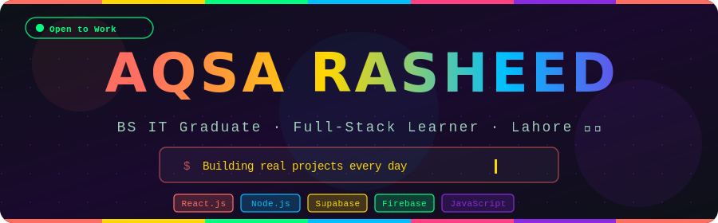
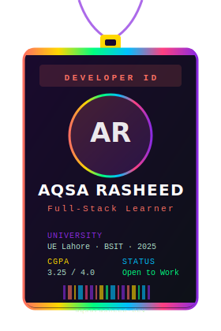
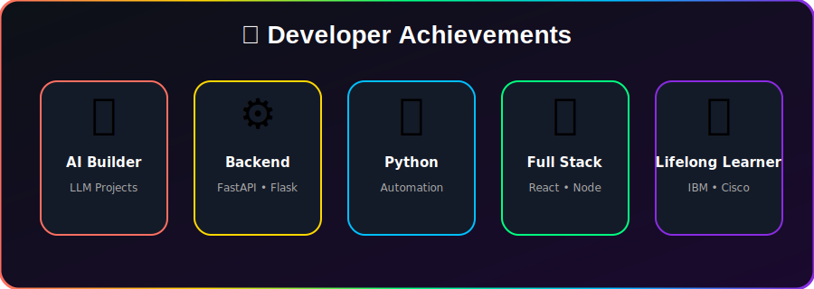

<picture>
  <source media="(prefers-color-scheme: dark)" srcset="./assets/banner-dark.svg">
  <source media="(prefers-color-scheme: light)" srcset="./assets/banner-light.svg">
  
</picture>

 

<table>
<tr>

<td width="35%" align="center">

</td>

<td width="65%">

# 👋 Hi, I'm Aqsa Rasheed

### Software Developer • Backend AI Intern • AI Enthusiast

I'm passionate about building intelligent software solutions through backend development, Artificial Intelligence, and modern web technologies.

I enjoy solving real-world problems, learning new technologies, and continuously improving my skills through hands-on projects.

### 🚀 Current Focus

- 🤖 Backend AI Intern
- 🧠 Learning LLMs & RAG
- ⚡ FastAPI Development
- 🌐 Full Stack Applications
- ☁️ Cloud Computing
- 💡 AI Engineering

</td>

</tr>
</table>

---

# 🛠 Tech Stack

---

# 🌟 Featured Projects

| 🚀 Project | Description |
|------------|-------------|
| 🤖 GuideAI | AI-powered CV Analyzer using FastAPI & Groq Llama 3 |
| 📧 Email Automation | Personalized bulk email marketing system |
| 🔐 3CipherVault | Browser-based encryption tool |
| 💳 LoanIQ | Loan Eligibility Calculator |

---

# 📊 GitHub Statistics

  

---

# 📈 Contribution Graph

---

---

# 🐍 Contribution Snake

---

# 📜 Certifications

- IBM — Mastering RAG
- IBM — Large Language Models
- IBM — AI Fundamentals
- IBM — Generative AI
- Microsoft — Azure ML Studio
- Cisco — Data Science Essentials
- Deloitte — Technology Job Simulation
- Quantium — Software Engineering Simulation

---

# 🌐 Connect With Me

  

  

> ⭐ **"Every project is an opportunity to learn, every challenge a chance to build something meaningful."**

